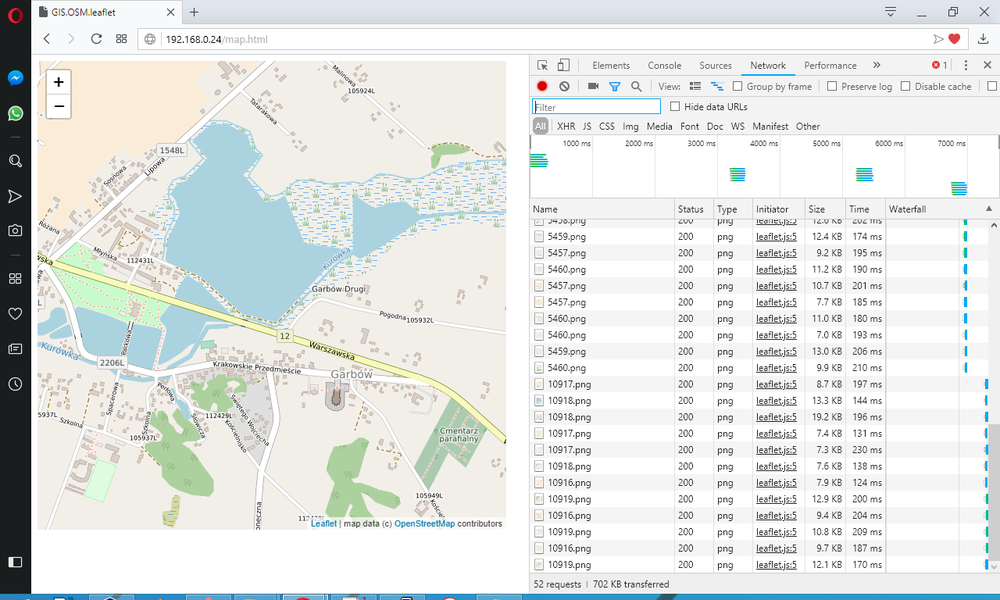

# Research & Development

Place acting as programming playground with various experiments and other efforts. Each sample not yet ready to become separate repository which will be as soon as gain some stability.

## WebGL
WebGL, three.js

## GIS
OpenStreetMap experiments.

## UNIX System V R4 2.1
Bringing legacy OS to life.

## Ruby on Rails
Sample applications with the most common and desired features. Covering also OpenShift Origin and microservices architecture. It is corresponding repository to the work-in-progress book.
