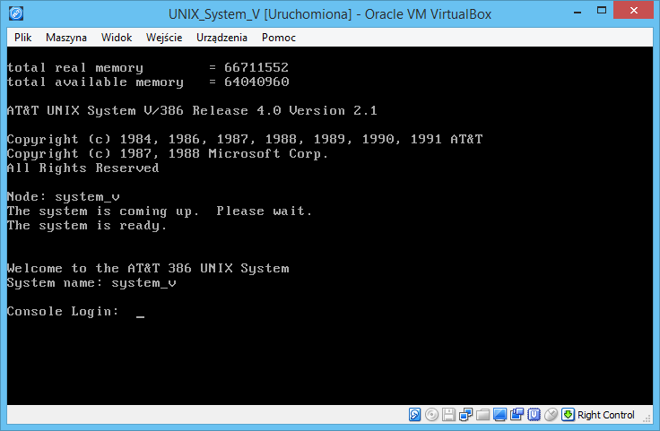

# UNIX System V R4 2.1

## Objectives
Up and running legacy operating system with regular utilities available as well as C compiler and possibly other things. However, there is problem finding any kind of native to the platform C compiler. There are other programming possibilities like```shell```, ```awk```, ```sed``` or even ```bc```. My personal preference is to use ```awk``` however it would be fun trying to create something in ```bc``` which stands for basic calculator.

## Installation
Diskettes can be found on the internet. It runs fine on ```VirtualBox``` but please note that there is 500MB hard disk drive limitation. Set up 64MB or RAM. Disable audio and USB. There are 10 main installation floppies, 2 additional for maintenance (?) and 1 for editing utilities which is only ```ed``` to be precise. In regular installation there is ```vi``` so we are good to go with editing files.

## Startup
After powering up VM you will get the following screen:



## License
Check if license allows me to put here a complete virtual hard disk drive image. We may think of System V as abandonware but this needs to be confirmed at source.
